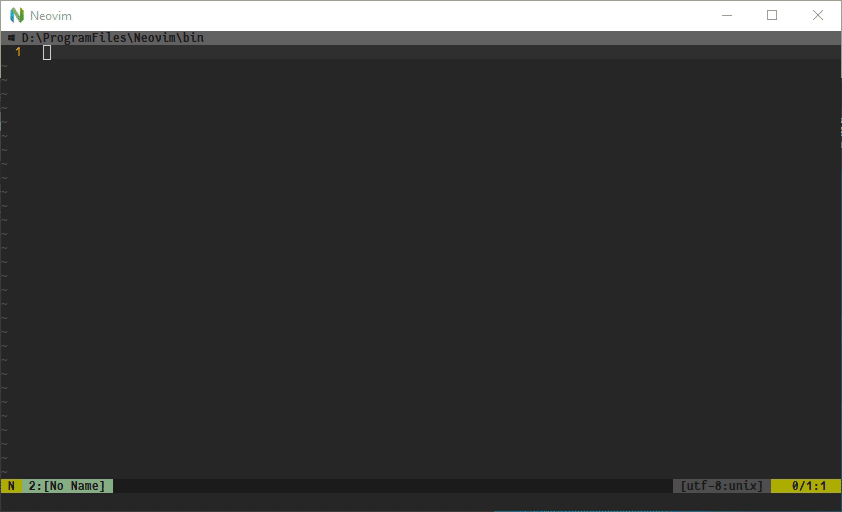

# neuims
An input method switcher.




## Table of Contents
- [Installation](#installation)
- [Usage](#usage)
- [Configuration](#configuration)


## Installation
### [vim-plug](https://github.com/junegunn/vim-plug)

```vim
Plug 'Neur1n/neuims'
```

If one does not want to always enable this plugin, using the on-demand loading
feature of vim-plug is recommended. Details of the command `:IMSToggle` will be
discussed in the following.

```vim
Plug 'Neur1n/neuims', {'on': 'IMSToggle'}
```

## Usage
### Enable
This plugin needs to be manually enabled before being used to switch input
methods. There are two ways to enable:

1. Using the command `:IMSToggle`.
2. Calling the function `neuims#Toggle()`, or using a key mapping, e.g.:
```vims
nnoremap <silent> <leader>it :call neuims#Toggle()<CR>
```

The command `:IMSToggle` is provided specifically for the purpose of working
with the on-demand loading feature of vim-plug. While using on-demand loading
to load this plugin, any functions of which will not be called before the
`:IMSToggle` command is called to enable neuims for the first time. This should
benefits those who work with multiple input methods occasionally.

### Disable
While in enabled status, use `:IMSToggle` or `<leader>it` again.

### Switch
Usually, the switching is automatically controlled by the `InsertEnter` and
`InsertLeave` event. However, one may call the function `neuims#Switch(0)`
to switch manually, or using a key mapping, e.g.:

```vim
nnoremap <silent> <leader>is :call neuims#Switch()<CR>
```


## Configuration
There are default configurations in the soure code:

```vim
let s:win = {
      \ 'im': 'US Keyboard',
      \ 'status': 0,
      \ 'keyboards': {
      \   'US Keyboard': 0x0409,
      \   'Microsoft Pinyin': 0x0804,
      \ },
      \ }

let s:ibus = {
      \ 'im': 'English (US)',
      \ 'status': 0,
      \ 'keyboards': {
      \   'English (US)': 'xkb:us::eng',
      \   'Pinyin': 'pinyin',
      \ },
      \ }
```

This should work well with Windows's (7/10) and Ubuntu's (16.04) built-in
input methods. Let's break it down:

- im: The input method specified here should be the "default" one, which is the
one in normal mode.
- status: `0` means neuims is not enabled, `1` means neuims is enabled. It is
controlled by the plugin itself, the user shall not care about it.
- keyboards: The two input methods one wants to use in normal/insert mode
should be specified here, one of which must have the same name of that in `im`.
For example, if `im` is specified as "English (US)", then there has to be
"English (US)" in `keyboards`.


## FAQ
Basically, these are questions I asked myself.

#### Q: Why another input method switcher?
A: I have not found a proper solution for input method switching for Windows up
to 2020.01.09.

#### Q: Why pynvim and pywin32 dependencies?
~~A: I wish I could use some CMD or PowerShell commands to finish the job, but
I have not found something working so far.~~

A: You should really update `neuims` right now. The dependencies were removed!🎉

#### Q: How about the other OSs?
~~A: Support for Ubuntu may be done soon, but I do not have a MacBook.~~

A: Support for IBus is released on 2020.01.16, tested on Ubuntu 16.04. I still
do not have a MacBook.


## TODO
[x] Support Windows 7/10

[x] Support Linux (IBus)

[x] Provide a status notification for statusline. (Please check commit
[ff8c961](https://github.com/Neur1n/dotfiles/commit/ff8c96179cf8ec98379e6c508d8029a104512f50)
of my [configuration](https://github.com/Neur1n/dotfiles).)
